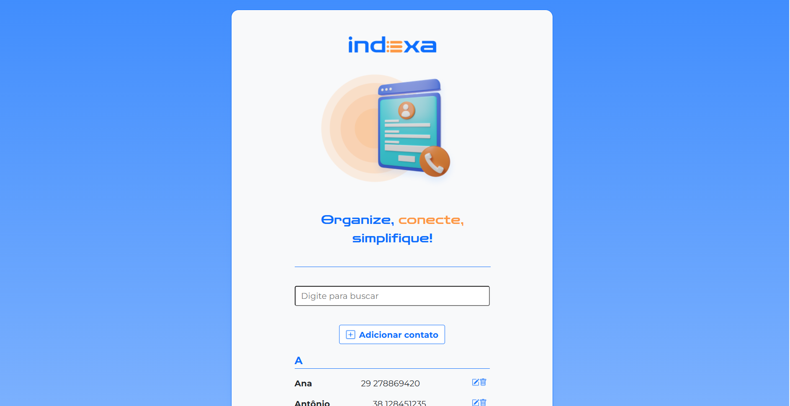

# Indexa

## ℹ️ Sobre

Projeto utilizado no curso para aprendizado das técnicas e melhores práticas.

## 📘Ementa

### Angular: construa uma aplicação web com componentes, linguagem de template e CLI

- Criar uma aplicação Angular e escreva componentes reutilizaveis
- Entender como utilizar a linguagem de template do Angular para controlar o fluxo dos dados com @for
- Explorar o uso do Angular CLI para criar aplicações e componentes
- Ganhar prática em estilizar componentes Angular com CSS
- Aprender a ler arquivos JSON em Angular e ajustar configurações no arquivo tsconfig.json para atender às necessidades do seu projeto

### Angular: evoluindo com formulários e roteamento

- Construir Formulários Reativos utilizando FormGroup e FormControl
- Implementar validações personalizadas nos campos do formulário com a classe Validators
- Utilizar @if para renderizar mensagens de erro de forma condicional
- Criar services e aplique a injeção de dependências para modularizar e reutilizar o código
- Estruturar o arquivo de rotas para uma navegação eficiente
- Explorar o routerLink para facilitar redirecionamentos dentro da aplicação
- Utilizar o serviço router e o método navigateByUrl para uma navegação programática eficaz

## 🖥️ Tecnologias

  
  
  

## 🧑‍🏫 Instrutor(es)

| [ Vinicios Neves](https://github.com/viniciosneves) | [ Nayanne Batista](https://github.com/nayannelbatista) |
| :-------------------------------------------------------------------------------------------------------------------------------------------------------: | :------------------------------------------------------------------------------------------------------------------------------------------------------------: |

## 💻 Screenshot

